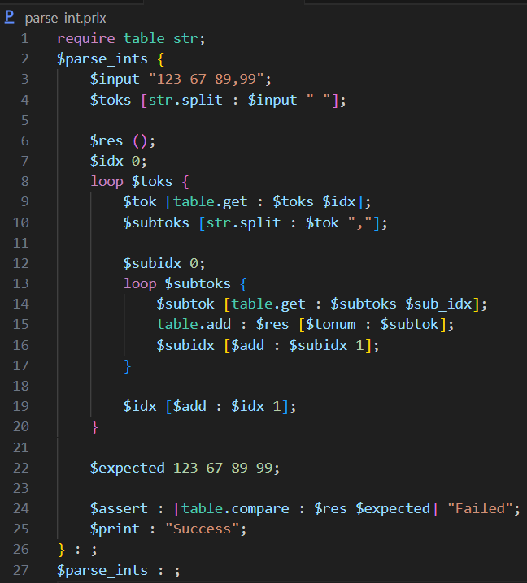

A versatile programming language with **simplicity**, **elegance** and **optimization**.

https://prolix-lang.github.io/

## Introduction
Prolix is ​​a general-purpose programming language and has a simple interface system along with many special features and support for many different fields. With Prolix syntax, it never touches commas and runs operators through functions instead of interpreting to solve a problem. Prolix here is aiming to simplify the process of writing and maintaining code while maximizing performance.

**Fast and Interoperable**
- Prolix provides high performance and interoperability with Java, allowing developers to seamlessly integrate code from Java.
- Developers can leverage existing libraries and code bases while benefiting from Prolix's simplicity and efficiency.
- With a focus on speed and efficiency, Prolix allows developers to code fast (or maybe not) and efficiently with ease.

**Simple and easy to use**
- Prolix has a clear and intuitive syntax, making it easy for developers to write and understand code.
- The language prioritizes simplicity and readability, ensuring that developers can quickly grasp its concepts and write maintainable code.

**Rich Feature Set**
- Prolix provides a rich set of features including variables, functions, control flows, data types, classes, and more.
- Support for advanced language constructs such as generics, inheritance, and operator overloading is planned, further enhancing Prolix's flexibility.
- The language aims to strike a balance between power and simplicity (sort of), giving developers the tools they need without unnecessary complexity.

## Project status
Prolix is ​​currently in the early stages of development, with a target of a working prototype by March 2024. The project covers many different aspects, including language implementation, features, and syntax.

Up to now, the project has the following structure and features:

**Language Implementation**
- [x] Lexer
- [x] Parser
- [x] Error Handling
- [x] Type Checking

**Language Features**
- [x] Variables
- [ ] Functions
- [ ] Control Flow
    - [ ] If Statement
    - [ ] Loop Statement
    - [ ] Forever Loop Statement
    - [ ] Conditional Loop Statement
- [ ] User-defined types
- [ ] Primitive types / Imported types
- [ ] Classes
- [ ] Generics
- [ ] Parameterized Types
- [ ] Inheritance
- [ ] Standard Library
- [ ] Package Manager
- [ ] Documentation
- [ ] Testing
- [ ] Benchmarking
- [ ] Profiling
- [ ] Debugging
- [ ] Error Handling
- [ ] Memory Management
- [ ] Concurrency

**Language Syntax**
- [x] Comments
- [x] Variables
- [x] Functions
- [x] Control Flow
- [x] Data Types
- [x] Classes
- [x] Inheritance

The project is under active development, with work ongoing to implement remaining features and enhance existing functionality. Contributions and feedback are welcome as we move toward our goal of creating a powerful and flexible language.

## Goals
The Prolix project aims to achieve the following goals:
- **Interoperability**: Prolix provides high performance and interoperability with Java, allowing developers to seamlessly integrate code from Java.
- **Performance**: The language will prioritize speed and efficiency, allowing developers to code quickly and efficiently without sacrificing simplicity.
- **Simplicity**: Prolix will have a clear and intuitive syntax, making it easy for developers to write and understand code.
- **Rich Feature Set**: The language will provide a rich feature set including variables, functions, control flows, data types, classes, and more, giving developers the tools they need to write powerful code.
- **Documentation**: Prolix will provide comprehensive documentation to help developers learn the language and take full advantage of its features.
- **Testing and Benchmarking**: The project will include powerful testing and benchmarking tools to ensure the reliability and performance of the language.
- **Community Involvement**: The Prolix project will encourage community participation, welcoming contributions, feedback and collaboration to help improve the language.
- **Standard Library**: Prolix will include a standard library with many functions and modules to support common programming tasks.
- **Package Manager**: The language will have a package manager to help developers discover, install, and manage third-party libraries and tools.
- **Debugging and Profiling**: Prolix will provide code profiling and debugging tools to help developers identify and fix problems and optimize performance.
- **Memory Management**: The language will include memory management features to help developers manage memory effectively and avoid memory leaks and other issues.
- **Concurrency**: Prolix will support concurrency to enable developers to write efficient, parallel code for multicore and distributed systems.
- **Error Handling**: The language will provide powerful error handling features to help developers write reliable and flexible code.